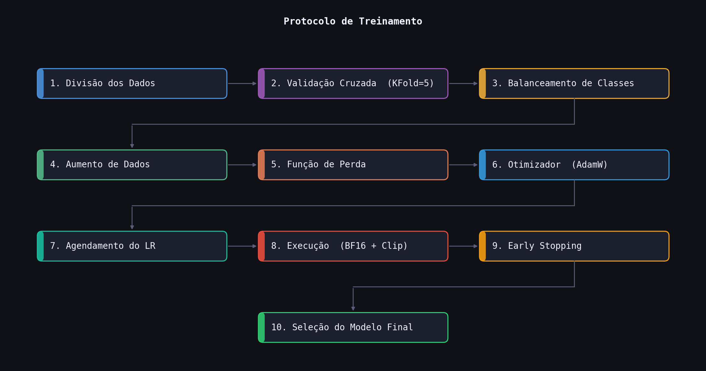

# Reconhecimento Contínuo de Emoções em Música com CNNs Baseadas em Representações Espectrais

**Autor:** Augusto Wielens Jerke  
**Orientador:** Prof. Paulo Ricardo Baptista Betencourt  
**Instituição:** Universidade Regional Integrada do Alto Uruguai e das Missões (URI) — Santo Ângelo, RS, Brasil  
**Contato:** augustowjerke@aluno.santoangelo.uri.br

---

## Sobre o Projeto

Este repositório contém o código do Trabalho de Conclusão de Curso (TCC) sobre **Music Emotion Recognition (MER)** — reconhecimento automático de emoções em músicas a partir de áudio.

O sistema utiliza redes neurais convolucionais (CNNs) para prever valores contínuos de **arousal** (ativação) e **valência** (positividade) em janelas de 4 segundos de áudio, mapeando cada trecho ao espaço bidimensional do modelo circumplexo de Russell. Três tipos de representações espectrais são avaliados: Mel Spectrogram (MEL), Espectrograma de Fourier de Curto Prazo (STFT) e Coeficientes Cepstrais de Frequência Mel (MFCC).

O dataset utilizado é o [DEAM](https://cvml.unige.ch/databases/DEAM/) (Database for Emotional Analysis of Music), com anotações dinâmicas frame a frame de arousal e valência para mais de 2.000 músicas.

---

## Pipeline Geral

```
Áudio MP3 (DEAM)
     ↓
Extração de Espectrogramas (MEL / STFT / MFCC)
     ↓
Cache de Features por Música (.pt)
     ↓
Treinamento com Validação Cruzada 5-Fold
     ↓
Avaliação (RMSE, MAE, Pearson, CCC, F1)
     ↓
Inferência em Áudio Arbitrário
```



---

## Estrutura do Repositório

```
projeto_mer/
├── train.py               # Loop de treinamento (5-fold cross-validation)
├── predict.py             # Inferência em qualquer arquivo de áudio
├── model.py               # Arquitetura ResNet18MER
├── dataset.py             # Dataset loader e extração de features
├── evaluate_chorus.py     # Avaliação em lote com geração de gráficos
├── preprocess.py          # Extração de features em paralelo (cache .pt)
├── preprocess_deam.py     # Normalização dos CSVs do DEAM
├── compute_stats.py       # Cálculo de estatísticas para normalização
├── analise_tcc.py         # Análise estatística (testes de Wilcoxon, curvas)
├── benchmark.py           # Monitoramento de CPU/GPU e serialização de resultados
├── plot_pipeline.py       # Gera a figura do pipeline de treinamento
├── analises/                        # Notebooks Jupyter
│   ├── main.ipynb                   # Notebook exploratório principal
│   └── benchmark.ipynb              # Benchmarking e comparações
├── pyproject.toml         # Dependências do projeto
├── data/
│   ├── dynamic_annotations.csv      # ~130k frames com arousal/valência
│   ├── static_annotations.csv       # Metadados por música
│   └── stats.json                   # Estatísticas de normalização (MEL/STFT/MFCC)
├── figuras_tcc/                     # Figuras geradas para o TCC
├── analise_tcc/                     # Scatter plots e curvas de aprendizado
└── resultados/                      # Logs de treinamento
    ├── resultados_resnet18_mel_dinamico.json
    ├── resultados_resnet18_mfcc_dinamico.json
    └── resultados_resnet18_stft_dinamico.json
```

> Diretórios ignorados pelo git: `data/deam/`, `data/processed/`, `checkpoints/`, `cache/`

---

## Representações Espectrais

| Modo | Bins de Frequência | Passos de Tempo | Descrição |
|------|--------------------|-----------------|-----------|
| **MEL** | 128 | 173 | Escala perceptual (sistema auditivo humano) |
| **STFT** | 128* | 173 | Espectro de frequência bruto (*reduzido de 513) |
| **MFCC** | 13 | 173 | Coeficientes cepstrais (características tímbricas) |

Parâmetros de áudio: 22.050 Hz, janela de 4s, FFT 1024, hop 512.

---

## Arquiteturas de Modelo

### ResNet18MER (Transfer Learning)
ResNet18 pré-treinada no ImageNet, adaptada para entrada monocanal. Camadas iniciais congeladas (`conv1`, `bn1`, `layer1`); backbone fine-tuned com taxa de aprendizado diferenciada. Cabeça de saída: `Flatten → Dropout(0.5) → Dense(512→128) → Dense(128→2) → Sigmoid`.

---

## Treinamento

- **Validação cruzada:** 5-fold estratificada (90% treino / 10% teste fixo)
- **Função de perda híbrida:**  
  `Loss = 0.5 × SmoothL1 + 0.25 × (1 − CCC_Arousal) + 0.25 × (1 − CCC_Valence)`
- **Otimizador:** AdamW com taxas de aprendizado diferenciadas (LR = 3e-4 / 1.5e-5 nas camadas congeladas)
- **Scheduler:** Warmup linear (5 épocas) → Cosine Annealing
- **Aumento de dados:** Mixup assimétrico (favorece amostras de emoções minoritárias) + mascaramento de frequência/tempo
- **Balanceamento:** WeightedRandomSampler por quadrante emocional + subamostragem configurável
- **Precisão mista:** BF16 em CUDA (aceleração de 2–3×)
- **Early stopping:** paciência de 15 épocas monitorando a perda de validação

---

## Métricas de Avaliação

**Regressão (nível de frame):**
- RMSE, MAE, Correlação de Pearson, CCC (Concordance Correlation Coefficient), R²

**Classificação (quadrantes emocionais):**
- F1-macro, Acurácia, Matriz de Confusão

**Análise estatística:**
- Testes de Wilcoxon signed-rank para comparação pareada entre modos (MEL vs STFT vs MFCC)
- Comparação contra baseline trivial (predição constante = média do treino)

---

## Como Usar

### 1. Instalar dependências

```bash
pip install -e .
```

Requer Python 3.12+ e PyTorch com suporte a CUDA.

### 2. Preparar o dataset DEAM

Baixe o dataset em [cvml.unige.ch/databases/DEAM](https://cvml.unige.ch/databases/DEAM/) e coloque os arquivos em `data/deam/`.

```bash
python preprocess_deam.py     # Normaliza os CSVs de anotação
python preprocess.py           # Extrai e cacheia os espectrogramas
python compute_stats.py        # Calcula estatísticas de normalização
```

### 3. Treinar os modelos

```bash
python train.py --modo mel  --arch resnet18 --epochs 100
python train.py --modo stft --arch resnet18 --epochs 100
python train.py --modo mfcc --arch resnet18 --epochs 100
```

Os checkpoints são salvos em `checkpoints/resnet18_{modo}_dinamico_fold{1-5}_best.pt`.

### 4. Predizer emoções em um áudio

```bash
python predict.py --audio caminho/para/musica.mp3 --plot
```

Gera: arousal e valência por janela, quadrante emocional dominante, gráfico no espaço circumplexo de Russell.

### 5. Gerar análises do TCC

```bash
python analise_tcc.py
```

---

## Requisitos Computacionais

- GPU NVIDIA com suporte a CUDA (recomendado para treinamento com BF16)
- CPU multi-core para pré-processamento paralelo
- ~1,6 GB para cache de features + ~644 MB para checkpoints

---

## Dependências Principais

| Biblioteca | Versão | Uso |
|------------|--------|-----|
| PyTorch | 2.12.0 | Treinamento e inferência |
| TorchAudio | 2.11.0 | Transforms espectrais |
| TorchVision | 0.26.0 | ResNet18 pré-treinada |
| librosa | 0.11.0 | Carregamento de áudio |
| scikit-learn | 1.8.0 | Métricas e validação cruzada |
| scipy | 1.17.1 | Testes estatísticos |
| pandas | 3.0.1 | Manipulação de dados |
| matplotlib / seaborn | — | Visualizações |

Lista completa em [pyproject.toml](pyproject.toml).

---

## Referências

- Russell, J. A. (1980). A circumplex model of affect. *Journal of Personality and Social Psychology*, 39(6), 1161–1178.
- Soleymani, M. et al. (2013). 1000 Songs for Emotional Analysis of Music. *ACM MER Workshop*.
- Aljanaki, A. et al. (2017). Developing a benchmark for emotional analysis of music. *PLOS ONE*.
- He, K. et al. (2016). Deep Residual Learning for Image Recognition. *CVPR*.
